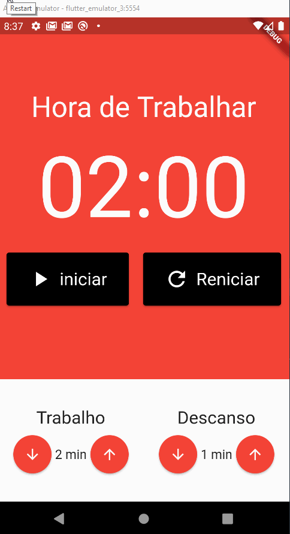

# Aplicativo Pomodoro Mobx/Provider
<p align="center">
    
</p>


<h2>Tópicos 📋</h2>

   <p>

   - [📖 Sobre](#-sobre)
   - [📱 Preview](#-preview)
   - [🛠️ Funcionalidades e Tecnologias Estudadas](#%EF%B8%8F-funcionalidades-e-tecnologias-estudadas)
   - [🤔 Como usar](#-como-usar)

   </p>

   <h2>📖 Sobre</h2>

<p>
 Desenvolvimento  de um app do método Pomodoro guiado pela Cod3rs utilizando o Mobx e Provider para genrenciar o estado da aplicação.
</p>

---


<h2>📱 Preview</h2>

   <p align="center">
      
   </p>
   <div align="center">
     <a align="center"> O tempo do Cronometro foi modificado para reduzir o previrew </a>
    </div>

---


<h2>🛠️ Funcionalidades e Tecnologias Estudadas</h2>

 - Packages Utilizados
    - mobx: ^2.0.1
    - flutter_mobx: ^2.0.5
    - cupertino_icons: ^1.0.2
    - provider: ^6.0.2
    - build_runner: ^2.0.6
    - mobx_codegen: ^2.0.2


- Funcionalidades
    - Cronometro para tempo de descanso 
    - Cronometro para tempo de  Trabalho 
    - Gerenciamento de estado utilizando Mobx e Provider


---

<h2>🤔 Como usar</h2>

   ```
   Configure o ambiente de desenvolvimento na sua máquina:
   https://flutter.dev/docs/get-started/install
   - Clone o repositório:
   $ git clone https://github.com/bhqn/Pomodoro-Mobx-Provider Pomodoro-Mobx-Provider
   - Entre no diretório:
   $ cd Pomodoro-Mobx-Provider
   - Instale as dependências:
   $ flutter pub get
   - Execute:
   $ flutter run
   ```

---

   > Esse projeto foi desenvolvido por **[@Bernardo_quintanilha](https://www.linkedin.com/in/bernardo-quintanilha-0baa84a4/)**, 
   

---

   <div align="center">
 <a align="center" href="https://www.linkedin.com/in/bernardo-quintanilha-0baa84a4/">
      
   </a>


   </div>

